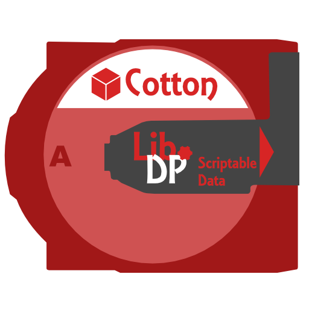

# Lib Data Potential


[>> Downloads <<](https://github.com/CottonMC/LibDP/releases)

*Let's play!*

**This mod is open source and under a permissive license.** As such, it can be included in any modpack on any platform 
without prior permission. We appreciate hearing about people using our mods, but you do not need to ask to use them. 
See the [LICENSE file](LICENSE) for more details.

Lib Data Potential, or LibDP, opens up new avenues of advanced customization of data-driven systems.

NOTE: This repo is under construction, documentation is not yet available beyond javadocs

## Diskettes
Diskettes are scripts written by an end user in a [Parchment](https://github.com/CottonMC/Parchment) supported language
to manipulate data-driven constructs in a way not possible with JSON or other libraries. Diskettes are capable of 
turing-complete conditional checks on the craftability of a recipe, including the state of the player and the world.

## On Scope
LibCD used to have a system called Tweakers which performed a similar function to diskettes. However, they had a much
wider scope, and allowed adding standard versions of any of the common vanilla recipe types. This resulted in the
project being massively bloated, and it was practically impossible for me to document everything satisfactorily. LibDP
is contracting on its scope, and is only going to have built-in support for things you can't do with other libs.

## Alternatives
Since LibDP has a very limited scope, here are some situations that LibDP is not designed for and are better done with
alternatives:
#### - I want to add a couple recipes to my world!
Vanilla JSON recipes are perfect for simple recipe alterations, as that's the purpose they're designed for. The
[crafting recipe builder](https://crafting.thedestruc7i0n.ca) by thedestruc7i0n is a great help for making JSON recipes.
#### - I want to add a lot of recipes to my modpack, or edit a lot of similar recipes!
[KubeJS](https://www.curseforge.com/minecraft/mc-mods/kubejs-fabric) is set up in a much better position for editing
existing recipes, and it has very good tools to add recipes in bulk as well. It has a lot of documentation and support
for other things such as adding your own blocks and items as well.
#### - I want to add recipes with custom NBT outputs!
[NBT Crafting](https://www.curseforge.com/minecraft/mc-mods/nbt-crafting) adds support for NBT on JSON recipe inputs and
outputs. Its dollar system also allows output NBT to depend on input NBT. If you want to do fancy things with recipes
without having to learn how to do full-on programming, this is your best bet.

## Legacy
The `legacy` folder in this repo contains the contents of the legacy loot and recipe drivers, updated from LibCD names
to LibDP ones. You are free to use them to create a legacy driver system for using the features removed from LibDP.
Please keep in mind the packages on each of the files.

## Sample Code (temporary)
Here is a sample diskette using some of the features of LibDP custom recipes. It will be moved to the wiki eventually.

```js
var RecipeTweaker = diskette.require("libdp.recipe.RecipeDriver");

//add a custom shaped recipe that lets you make a netherite pick without netherite - but for a price
RecipeDriver.addShaped(diskette,
    [["minecraft:soul_sand", "#minecraft:stone_tool_materials", "minecraft:soul_sand"],
     ["",                    "minecraft:stick",                 ""],
     ["",                    "minecraft:stick",                 ""]],
    "minecraft:netherite_pickaxe"
    );

//make sure that the player has enough health to craft
function matches(stacks, width, height, player, world) {
    return player.getHealth() >= 20 || player.isCreative();
}

//set a custom-colored and non-italicized name
function preview(stacks, width, height, player, output) {
    return output.setFormattedName("{\"italic\":false,\"color\":\"#4A2A23\",\"text\":\"Souled Netherite Pickaxe\"}");
}

function craft(stacks, player, output) {
    if (!player.isCreative()) {
        player.damage(19);
    }
}
```

# What happened to LibCD?

Long story short, drama happened. Tweakers caused a lot of drama, and when someone who had been causing me grief for a 
while said that libcd was obsolete due to their new mod, I agreed. LibCD is now primary geared towards developers, and 
pared down massively in scale. It become actively damaging to my health to continue maintaining it in the state it was 
in. There will be a successor to tweakers, but it will be pared back as well. I have plans for what I'd like to see out
of its new iteration.
